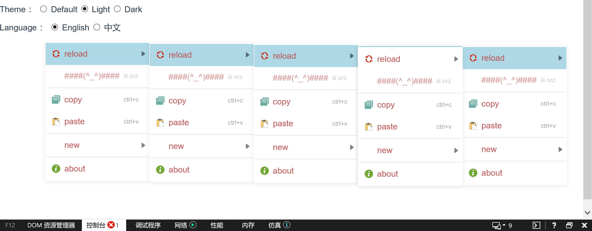

# Html5 ContextMenu

> 一款简单好用的浏览器右键菜单库

[](https://npm.im/@htmlos/contextmenu)

### 功能介绍

- [X] 简单易用, 支持html5, vue, react, 等
- [X] 支持无限多级子菜单
- [X] 支持点击事件回调
- [X] 支持菜单选项禁用
- [X] 支持菜单选项图标
- [X] 支持快捷方式描述
- [X] 支持自动适应浏览器弹出位置(保持菜单全部可见在浏览器可见区域内)
- [X] 支持自动隐藏(点击菜单外部区域/调整浏览器窗口大小时/滚动页面/按下esc时)
- [X] 支持自定义css样式


### 兼容性


| 浏览器| Chrome | FireFox | IE | Safari |
|  ---- | ------ | ------- | --- | ----- |
|  版本  |    ?   |    ?    |  9+ |  11+  |


### 使用

- 安装

```shell
# npm
npm i contextmenu.ts
# yarn
yarn add contextmenu.ts
```

- 导入
```js
import {ContextMenu, ContextMenuOptions} from "@htmlos/contextmenu";
import "@htmlos/contextmenu/dist/contextmenu.css";
```

- 自定义样式: 请参考 `contextmenu.css`
  - 限制
    - 内部使用`position:fixed`排版, 这会导致一些元素的某些样式会失效(如`.contextmenu`和`.contextmenu_item`的`margin`, 需要使用`padding`调整)
    - `.contextmenu`不要使用`transition`动画属性, 这不仅可能会在加载过程看不到, 还会影响后续自动定位, 
    - `.contextmenu_item`不要使用会影响尺寸的动画, 如果使用了可能会引起排版紊乱, 因为菜单可见后已经的固定大小的了
    - 其他动画属性请自测

- 配置: ``
  - i18n: (s)=>{ return translate(s); }
```js
// ContextMenu.config(options: CotextMenuOptions);
ContextMenu.config({
  i18n: function(s){
    return your_translate_function(s) || s;
  }
});
```

- 显示菜单
  
```js
const menu=[
  { // 选项
    name: "reload",
    icon: "./reload.png",
    disabled: false,
    onlick: ()=>{},
    hotkey: "ctrl+r",
    children: [
      //...
    ]
  },
  {}, // 分割线
  //...
]

menu[0].children=menu; // 无限子菜单

Contextmenu.show(menu); //显示
```

- 隐藏菜单
  
```js
Contextmenu.hide(); //隐藏
```

### 构建
- 调试

```shell
yarn serve
```

- 构建

```shell
yarn build
```

### License

[LGPL-3.0](./license.txt)
